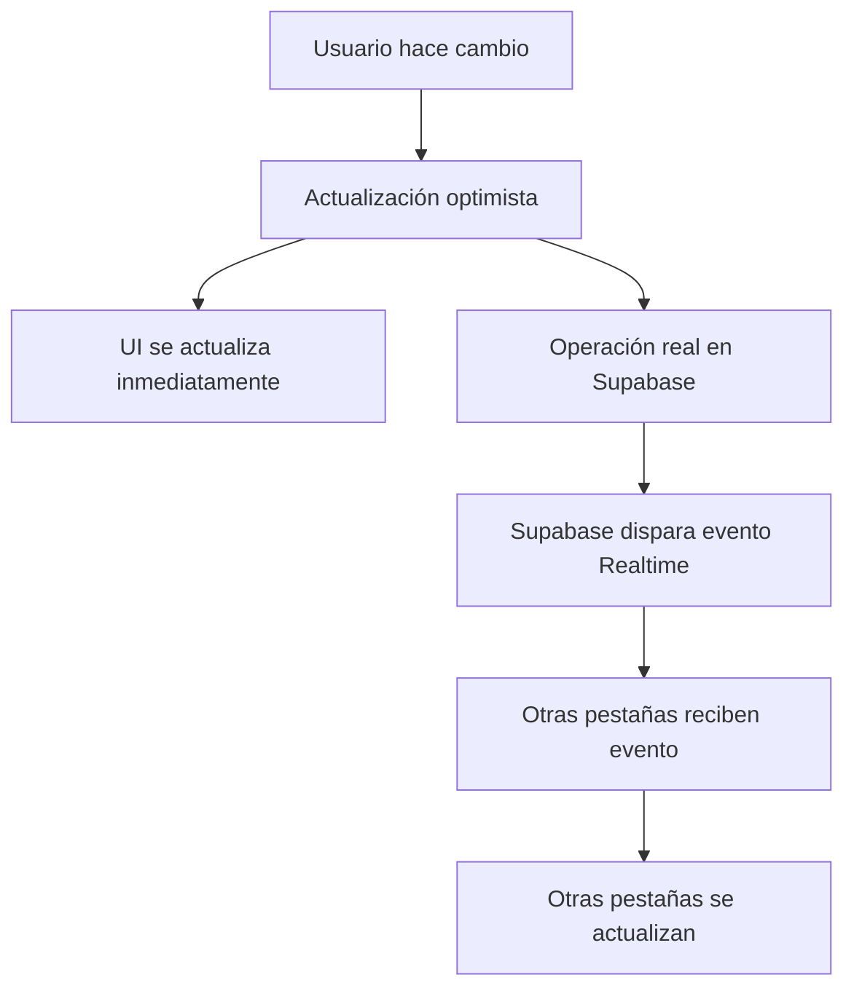

# 🔄 Configuración de Sincronización en Tiempo Real

## ✅ **Problema Solucionado**

El problema era que las actualizaciones optimistas solo modificaban el estado local sin disparar eventos de Supabase Realtime, por lo que otras pestañas no recibían las actualizaciones.

## 🚀 **Solución Implementada**

### **1. Sistema Híbrido: Optimista + Realtime**

- **Actualización optimista**: UI responsiva inmediata
- **Sincronización real**: Eventos de Supabase Realtime para otras pestañas
- **Mejor de ambos mundos**: Velocidad + Sincronización

### **2. Archivos Creados/Modificados**

#### **Nuevos Archivos:**
- `src/lib/realtime-sync.ts` - Funciones de sincronización con Supabase
- `src/hooks/use-realtime-crud.ts` - Hooks que combinan optimista + realtime
- `verify-realtime-setup.sql` - Script para configurar Supabase

#### **Archivos Modificados:**
- `src/app/admin/page.tsx` - Usa nuevos hooks con sincronización

## 📋 **Pasos para Configurar**

### **Paso 1: Ejecutar Script SQL en Supabase**

1. Ve al **SQL Editor** de tu proyecto Supabase
2. Copia y pega el contenido de `verify-realtime-setup.sql`
3. Ejecuta el script completo

### **Paso 2: Verificar Configuración**

El script verificará y configurará:
- ✅ Habilitación de Realtime para todas las tablas
- ✅ Políticas RLS (Row Level Security) 
- ✅ Publicaciones de eventos

### **Paso 3: Probar Sincronización**

1. **Abre dos pestañas**:
   - Pestaña 1: Panel de administración (`/admin`)
   - Pestaña 2: Página principal (`/`)

2. **Realiza cambios en el panel admin**:
   - Agregar/editar/eliminar servicios
   - Agregar/editar/eliminar productos
   - Actualizar contenido hero
   - Etc.

3. **Verifica sincronización**:
   - Los cambios deben aparecer **inmediatamente** en la pestaña principal
   - Sin necesidad de recargar la página

## 🔧 **Cómo Funciona**

### **Flujo de Actualización:**



### **Ventajas del Sistema:**

#### ✅ **UI Responsiva:**
- Cambios visibles **instantáneamente**
- No hay esperas ni loading states largos
- Experiencia de usuario fluida

#### ✅ **Sincronización Real:**
- Todas las pestañas se mantienen sincronizadas
- Cambios se propagan automáticamente
- No hay inconsistencias de datos

#### ✅ **Manejo de Errores:**
- Rollback automático si falla la operación
- Notificaciones claras de éxito/error
- Estado consistente en caso de fallos

## 🐛 **Solución de Problemas**

### **Si no funciona la sincronización:**

1. **Verificar consola del navegador**:
   ```javascript
   // Buscar estos mensajes:
   "🔄 Cambio detectado en [tabla]:"
   "📡 Estado de suscripción para [tabla]: SUBSCRIBED"
   ```

2. **Verificar configuración de Supabase**:
   - Ejecutar `verify-realtime-setup.sql` nuevamente
   - Verificar que las tablas estén en la publicación `supabase_realtime`

3. **Verificar políticas RLS**:
   - Asegurarse de que las políticas permitan operaciones
   - Verificar que RLS esté habilitado pero con políticas permisivas

### **Mensajes de Debug:**

El sistema incluye logging detallado:
- `🔄 Cambio detectado en [tabla]:` - Evento Realtime recibido
- `📡 Estado de suscripción para [tabla]: SUBSCRIBED` - Conexión exitosa
- `✅ Item [id] guardado en [tabla] y sincronizado en tiempo real` - Operación exitosa

## 🎯 **Resultado Final**

- **Panel admin**: Operaciones rápidas y responsivas
- **Página principal**: Actualizaciones en tiempo real
- **Múltiples pestañas**: Sincronización automática
- **Experiencia de usuario**: Fluida y profesional

## 📝 **Notas Técnicas**

### **Arquitectura:**
- **Frontend**: React hooks con estado optimista
- **Backend**: Supabase con Realtime habilitado
- **Sincronización**: Eventos de PostgreSQL + WebSockets

### **Performance:**
- **Latencia percibida**: ~0ms (actualización optimista)
- **Latencia real**: ~100-300ms (operación de red)
- **Sincronización**: ~50-100ms (evento Realtime)

### **Escalabilidad:**
- Sistema preparado para múltiples usuarios
- Eventos de Realtime escalan automáticamente
- Optimizaciones de archivos incluidas


